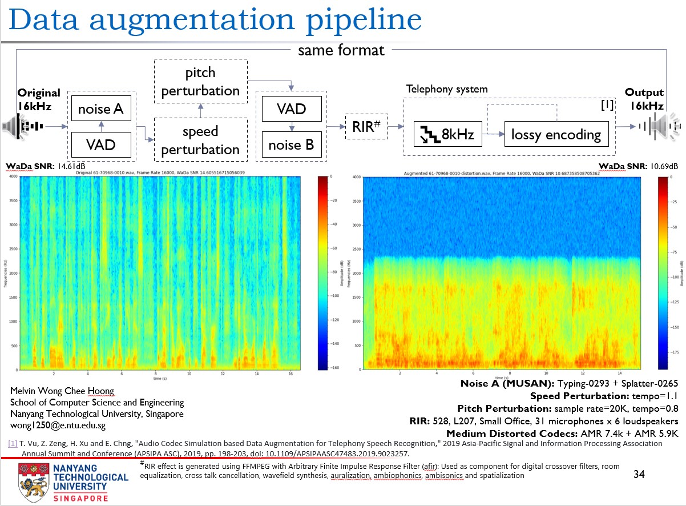

# Data Augmentation Toolkit
One of the key ingredients to develop a high performing DNN model is to train your model using augmented data [[1]](#1)[[2]](#2). 

The purpose of this codebase is to provide researchers a toolkit for augmenting speech audio data for model training purposes. The toolkit builds on the proposed technique published in the paper "Audio Codec Simulation based Data Augmentation for Telephony Speech Recognition" and extends it into a full configurable pipeline that is capable of:
- introducing background noises into speech segments, 
- change audio tempo,
- change audio pitch,
- stimulate room environmental noises and impulse responses,
- performs lossy encoding stimulating audio passing through a telephony system [[3]](#3)

The output of the augmented speech is saved into same source format. Following sections will introduce the datasets used in the augmentation process and how to get started.

## How to use the toolkit
1. Setup toolkit
Refer to [INSTALL document](INSTALL.md) in this repo to install this toolkit

## Datasets:
- ### [BUT Speech@FIT Reverb Database](https://speech.fit.vutbr.cz/software/but-speech-fit-reverb-database ) [[4]](#4):

  The database is being built with respect to collect a large number of various Room Impulse Responses, Room environmental noises (or "silences"), Retransmitted speech (for ASR and SID testing), and meta-data (positions of microphones, speakers etc.).

  The goal is to provide speech community with a dataset for data enhancement and distant microphone or microphone array experiments in ASR and SID.

  In this codebase, we only use the RIR data, which is used to synthesize far-field speech, the composition of the RIR dataset and citation details are as follows.

  | Folder Name | Room Name |    Room Type    |  Size Type  | Size (length, depth, height) (m) | (microphone_num x   loudspeaker_num) |
  | :-------: | :-------: | :-------------: | :------------------------------: | :------------------------------: | :----------------------------------: |
  |   VUT_FIT_Q301   |   Q301    |     Office      |     Large      |           10.7x6.9x2.6           |                31 x 3                |
  |   VUT_FIT_L207   |   L207    |     Office      |     Small      |           4.6x6.9x3.1            |                31 x 6                |
  |   VUT_FIT_L212   |   L212    |     Office      |     Medium      |           7.5x4.6x3.1            |                31 x 5                |
  |   VUT_FIT_L227   |   L227    |     Stairs      |     Small      |           6.2x2.6x14.2           |                31 x 5                |
  |   Hotel_SkalskyDvur_Room112   |   R112    |   Hotel room    |     Small      |           4.4x2.8x2.6            |                31 x 5                |
  |   Hotel_SkalskyDvur_ConferenceRoom2   |    CR2    | Conference room |     Large      |          28.2x11.1x3.3           |                31 x 4                |
  |   VUT_FIT_E112   |   E112    |  Lecture room   |     Large      |          11.5x20.1x4.8           |                31 x 2                |
  |   VUT_FIT_D105   |   D105    |  Lecture room   |     Large      |          17.2x22.8x6.9           |                31 x 6                |
  |   VUT_FIT_C236   |   C236    |  Meeting room   |     Medium      |           7.0x4.1x3.6            |               31 x 10                |

- ### [MUSAN database](https://arxiv.org/pdf/1510.08484) [[5]](#5):
  The dataset consists of music from several genres, speech from twelve languages, and a wide assortment of technical and non-technical noises. In this toolkit, only the noise subset is used.

## Special thanks to contributors
Creation of this toolkit relied heavily on contributors providing requirements, technical insights, codebases and invaluable feedback on how to make it better for researchers. Their input are invaluable, and would like to take a moment and thank and recognize them for all their hardwork:

### Technical Insights Contributors:
- [Assoc Prof Chng Eng Siong](https://personal.ntu.edu.sg/aseschng/intro1.html)

### Codebase Contritubors:
- [Yunqi Chen](https://github.com/Jasson-Chen/Add_noise_and_rir_to_speech)

## References
<a id="1">[1]</a>
Wei, Shengyun, Shun Zou, and Feifan Liao, 
A Comparison on Data Augmentation Methods Based on Deep Learning for Audio Classification, 
In Journal of Physics: Conference Series, vol. 1453, no. 1, p. 012085, 
IOP Publishing, 
2020
[DOI 10.1088/1742-6596/1453/1/012085](https://iopscience.iop.org/article/10.1088/1742-6596/1453/1/012085)

<a id="2">[2]</a>
Akkaya, Ilge, Marcin Andrychowicz, Maciek Chociej, Mateusz Litwin, Bob McGrew, Arthur Petron, Alex Paino et al., 
Solving rubik's cube with a robot hand, 
arXiv preprint [arXiv:1910.07113](https://arxiv.org/abs/1910.07113), 2019

<a id="3">[3]</a> 
Vu, Thi-Ly and Zeng, Zhiping and Xu, Haihua and Chng, Eng-Siong,
Audio Codec Simulation based Data Augmentation for Telephony Speech Recognition,
2019 Asia-Pacific Signal and Information Processing Association Annual Summit and Conference (APSIPA ASC), 
pp. 198-203, 
[doi: 10.1109/APSIPAASC47483.2019.9023257](https://ieeexplore.ieee.org/document/9023257)

<a id="4">[4]</a>
Szöke, I., Skácel, M., Mošner, L., Paliesek, J., & Černocký, J.,
Building and evaluation of a real room impulse response dataset, 
IEEE Journal of Selected Topics in Signal Processing 13.4, 
2019, 
863-876 [arXiv:1811.06795](https://arxiv.org/abs/1811.06795)

<a id="5">[5]</a>
Snyder, David, Guoguo Chen, and Daniel Povey, 
Musan: A music, speech, and noise corpus, 
arXiv preprint [arXiv:1510.08484](https://arxiv.org/abs/1510.08484), 2015
