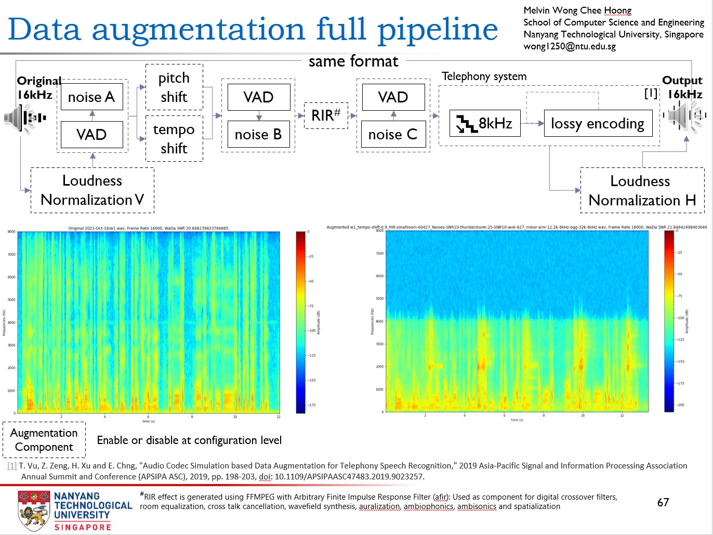

# Data Augmentation Toolkit
One of the key ingredients to develop a high performing DNN model is to train your model using augmented data [[1]](#1)[[2]](#2). 

The purpose of this codebase is to provide researchers a toolkit for augmenting speech audio data for model training purposes. The toolkit builds on the proposed technique published in the paper "Audio Codec Simulation based Data Augmentation for Telephony Speech Recognition" and extends it into a full configurable pipeline that is capable of:
- normalize loudness at pre or post step,
- introducing background noises,
- change audio tempo,
- change audio pitch,
- stimulate room environmental noises and impulse responses,
- performs lossy encoding, stimulating audio passing through a telephony system [[3]](#3)

The output of the augmented speech is saved into same source format. Following sections will introduce the datasets used in the augmentation process and how to get started.

## Requirements
This toolkit is designed to operate in Linux environment and has been tested to work in Ubuntu 20.04. You can attempt to use this toolkit in Windows environment using WSL. If you have manage to get this toolkit work in your own OS environment not stated here, welcome to share it in the discussions section. 

## Getting started
1. Setup toolkit
 Refer to [INSTALL document](INSTALL.md) in this repo to install the dependencies and this toolkit

2. Configure toolkit
 Refer to [figure 1](#fig1) the overview of the pipeline design. In this toolkit, multiple configuration and data files are used to customize the toolkit:

    2.1 Program Files
    - [preprocess_data.sh](preprocess_data.sh)
     A help bash script that execute the toolkit and the generated bash script to run the augmentation process
        - Set **DATA_DIR** parameter to folder containing source wave files
        - Set **DEST_DIR** parameter to folder holding wave files generated by the program
        *Note:* Ensure the bash script file permission has execution rights  

    2.2 Configuration Files
    - [distortion_codecs.conf](distortion_codecs.conf)
     This file contains specific codecs used in generating the lossly audio passing through a stimulated telephony system
    - [config.conf](config.conf)
     Main configuration file to enable/disable components in the pipeline and set the required parameters for each component. Refer to [figure 1](#fig1) what augmentation components are available.
        - Ensure **DISTORTION_CONFIG_FILE** parameter is set to the [distortion_codecs.conf](distortion_codecs.conf) file location
        - Ensure **REVERDB_DIR** parameter is set to the folder containing room reverberation wave files. If files are not found, program will attempt to download the files and store it in this folder location. Ensure that the folder permission is configured correctly and internet connection is available.
        - Ensure **NOISE_DIR** parameter is set to the folder containing background noise wave files. If files are not found, program will attempt to download the files and store it in this folder location. Ensure that the folder permission is configured correctly and internet connection is available.
    - [codecs.info](codecs.info)
     This file contains the mapping from Soundfile library codec format string to ffmpeg codec ID and is used to define the required codecs in generated ffmpeg commands.
        - Ensure this file is stored in <PROGRAM_ROOT_DIRECTORY>/config
    - [codecs_for_torch.info](codecs_for_torch.info)
     This file contains the mapping from Soundfile library codec format string to TorchAudio codec ID and is used to define the required codecs to export/save processed audio.
        - Ensure this file is stored in <PROGRAM_ROOT_DIRECTORY>/config

3. Commence augmentation
 **Option 1:** Run preprocess_data.sh 
 **Option 2:** Run preprocess.py and, then run the generated make_distorted_wavs.sh

4. Collect the augmented audio in your target directory :sunglasses:

5. Trace the actual augmentation operations on each source audio file
The toolkit generates a log file, *cocktail.json*, that details the actual augmentation methods and settings applied on each source audio file.

<a id="fig1">*
**Figure 1:** Data Augmentation Pipeline
*</a>

## Datasets:
- ### [BUT Speech@FIT Reverb Database](https://speech.fit.vutbr.cz/software/but-speech-fit-reverb-database ) [[4]](#4):

  The database is being built with respect to collect a large number of various Room Impulse Responses, Room environmental noises (or "silences"), Retransmitted speech (for ASR and SID testing), and meta-data (positions of microphones, speakers etc.).

  The goal is to provide speech community with a dataset for data enhancement and distant microphone or microphone array experiments in ASR and SID.

  In this codebase, we only use the RIR data, which is used to synthesize far-field speech, the composition of the RIR dataset and citation details are as follows.

  | Folder Name | Room Name |    Room Type    |  Size Type  | Size (length, depth, height) (m) | (microphone_num x   loudspeaker_num) |
  | :-------: | :-------: | :-------------: | :------------------------------: | :------------------------------: | :----------------------------------: |
  |   VUT_FIT_Q301   |   Q301    |     Office      |     Large      |           10.7x6.9x2.6           |                31 x 3                |
  |   VUT_FIT_L207   |   L207    |     Office      |     Small      |           4.6x6.9x3.1            |                31 x 6                |
  |   VUT_FIT_L212   |   L212    |     Office      |     Medium      |           7.5x4.6x3.1            |                31 x 5                |
  |   VUT_FIT_L227   |   L227    |     Stairs      |     Small      |           6.2x2.6x14.2           |                31 x 5                |
  |   Hotel_SkalskyDvur_Room112   |   R112    |   Hotel room    |     Small      |           4.4x2.8x2.6            |                31 x 5                |
  |   Hotel_SkalskyDvur_ConferenceRoom2   |    CR2    | Conference room |     Large      |          28.2x11.1x3.3           |                31 x 4                |
  |   VUT_FIT_E112   |   E112    |  Lecture room   |     Large      |          11.5x20.1x4.8           |                31 x 2                |
  |   VUT_FIT_D105   |   D105    |  Lecture room   |     Large      |          17.2x22.8x6.9           |                31 x 6                |
  |   VUT_FIT_C236   |   C236    |  Meeting room   |     Medium      |           7.0x4.1x3.6            |               31 x 10                |

- ### [Simulated Room Impulse Responses (RIRs)](https://www.openslr.org/28/)
  This dataset includes all the room impulse responses (RIRs) and noises used in our paper "A Study on Data Augmentation of Reverberant Speech for Robust Speech Recognition" submitted to ICASSP 2017. It includes the real RIRs and isotropic noises from the RWCP sound scene database, the 2014 REVERB challenge database and the Aachen impulse response database (AIR); the simulated RIRs generated by ourselves and also the point-source noises that extracted from the MUSAN corpus.
  Only the Simulated Room Impulse Responses subset is used, comprises of large rooms, medium rooms and small rooms impulse responses. (Total ~60K audio files.)

- ### [MUSAN database](https://arxiv.org/pdf/1510.08484) [[5]](#5):
  The dataset consists of music from several genres, speech from twelve languages, and a wide assortment of technical and non-technical noises. In this toolkit, only the noise subset is used.

## Special thanks to contributors
Creation of this toolkit relied heavily on contributors providing requirements, technical insights, codebases and invaluable feedback on how to make it better for researchers. Their input are invaluable, and would like to take a moment and thank and recognize them for all their hardwork:

### Technical Insights Contributors:
- [Assoc Prof Chng Eng Siong](https://personal.ntu.edu.sg/aseschng/intro1.html)

### Codebase Contritubors:
- [Yunqi Chen](https://github.com/Jasson-Chen/Add_noise_and_rir_to_speech)

## References
<a id="1">[1]</a>
Wei, Shengyun, Shun Zou, and Feifan Liao, 
A Comparison on Data Augmentation Methods Based on Deep Learning for Audio Classification, 
In Journal of Physics: Conference Series, vol. 1453, no. 1, p. 012085, 
IOP Publishing, 
2020
[DOI 10.1088/1742-6596/1453/1/012085](https://iopscience.iop.org/article/10.1088/1742-6596/1453/1/012085)

<a id="2">[2]</a>
Akkaya, Ilge, Marcin Andrychowicz, Maciek Chociej, Mateusz Litwin, Bob McGrew, Arthur Petron, Alex Paino et al., 
Solving rubik's cube with a robot hand, 
arXiv preprint [arXiv:1910.07113](https://arxiv.org/abs/1910.07113), 2019

<a id="3">[3]</a> 
Vu, Thi-Ly and Zeng, Zhiping and Xu, Haihua and Chng, Eng-Siong,
Audio Codec Simulation based Data Augmentation for Telephony Speech Recognition,
2019 Asia-Pacific Signal and Information Processing Association Annual Summit and Conference (APSIPA ASC), 
pp. 198-203, 
[doi: 10.1109/APSIPAASC47483.2019.9023257](https://ieeexplore.ieee.org/document/9023257)

<a id="4">[4]</a>
Szöke, I., Skácel, M., Mošner, L., Paliesek, J., & Černocký, J.,
Building and evaluation of a real room impulse response dataset, 
IEEE Journal of Selected Topics in Signal Processing 13.4, 
2019, 
863-876 [arXiv:1811.06795](https://arxiv.org/abs/1811.06795)

<a id="5">[5]</a>
Snyder, David, Guoguo Chen, and Daniel Povey, 
Musan: A music, speech, and noise corpus, 
arXiv preprint [arXiv:1510.08484](https://arxiv.org/abs/1510.08484), 2015
